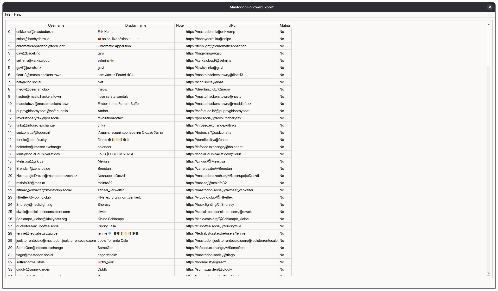

<div align="center">

# mastodon-follower-export

[](https://docs.astral.sh/uv/)
[](./LICENSE)
[](https://github.com/thcrt/tattl/actions/workflows/publish.yml)




</div>

mastodon-follower-export is a tool to view and export a list of your followers on the Fediverse. 

### Features
- **Installed and run locally** so no data is sent to any server besides your own instance
- **Graphical interface** for non-technical people to use
    - Export to CSV function
    - Background loading and refreshing
- **Command-line interface** for use in scripting
    - ASCII table display
    - CSV output
- **Keychain integration** so you only need to log in once
- **Windows and Linux support**

### Installation

Download the executable binary from the [latest release](https://github.com/thcrt/mastodon-follower-export/releases/latest). Windows users should use `mastodon_follower_export.exe`, Linux users should use ` mastodon_follower_export.bin`. The executable is portable and can be run directly, or moved to an easily accessible location.

### Usage

To use the GUI, just double-click to run the application.

To use the CLI, consult `mastodon_follower_export --help`. A typical workflow will look like this:
```sh
mastodon_follower_export login <instance>
# follow the instructions to log in

mastodon_follower_export list
# shows an ASCII table when run interactively

mastodon_follower_export list > followers.csv
# uses CSV format when piped
```

### Copyright

This program's binaries and source code copyright 2026 Theo Court. Licensed under the Mozilla Public License version 2.0.

### AI statement

None of the contents of this repository, whether code, documentation or otherwise, were generated by AI. Everything you see here was made entirely by a human with love.
